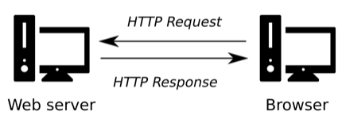

# Techniek Filosofie Onepager

Voor techniek filosifie ga je in html+css een onepager bouwen over jouw onderwerp. Je krijgt drie workshops html+css, de materialen daarvoor vind je in deze repository.

- Les 1: basics van html en css
- Les 2: een responsive blog bouwen met semantische elementen
- Les 3: een onderzoeksartikel online zetten

 
 
 

## HTML LES 1 

- Wat is een web server?
- Start met een leeg static html project op [glitch.com](https://glitch.com) of [https://codesandbox.io](https://codesandbox.io)
- HTML tags voor basic layout: `a, img, h1, p, br`
- Divs als containers voor tekst en afbeeldingen.
- Default CSS bekijken in de inspector
- Block heeft hoogte en breedte. Blocks worden onder elkaar geplaatst.
- Inline heeft geen hoogte en breedte en wordt naast elkaar geplaatst.
- CSS basics: `width, height, margin, padding, border, color, units, font-family (sans, sans-serif, mono)`
- Wat is [Document Flow ?](https://developer.mozilla.org/en-US/docs/Learn/CSS/CSS_layout/Normal_Flow) en waarom je geen absolute positioning gebruikt.
- Toegankelijkheid, SEO en responsiveness. Testen met W3 Validator.

### Github Pages opzetten

- Uitleg github pages. Klik op de knop **use this template** in dit [start project](https://github.com/HR-CMGT/html-startproject)
- [Stackoverflow](https://stackoverflow.com) (let op datum van de posts). [dev.to](https://dev.to)

 
 
 

## HTML LES 2

**HTML**

- Header, Nav balk, Sections [(Semantic HTML)](https://www.w3schools.com/html/html5_semantic_elements.asp)
- Afbeelding met caption voor bronvermelding
- Socials in footer
- Links in dezelfde pagina met `<a>` tags.
- Meta tags (SEO / social)

**CSS**

- [Basis CSS](https://www.w3schools.com/cssref/css_default_values.asp) van elementen bekijken.
- Elementen selecteren met tags, id's en classes. Geneste elementen selecteren.
- Identiteit ontwerpen: kies een [font](https://fonts.google.com) en [kleurpalet](https://coolors.co) dat bij het onderwerp past. Je kan ook twee fonts kiezen: een fancy font voor de headers, en een rustig font voor de body tekst.
- Begin met een mooie grote header foto. Gebruik `cover` om achtergrondafbeelding te laten schalen
- Witruimte maken voor de sections en teksten voor leesbaarheid (`margin, padding, font-size`)
- Maak foto's passend met `object-fit`.
- Het verschil tussen `%` en `vw, vh`.
- [Flex Box](https://css-tricks.com/snippets/css/a-guide-to-flexbox/) gebruiken om elementen naast elkaar te zetten.

**RESPONSIVE CSS**

- Meta viewport tag!
- Layout past zich aan aan mobiele schermen
- Gebruik `@media` query en relatieve eenheden (`%, vw, vh`)

 
 
 

## HTML LES 3

- Inhoud blog in orde maken voor Techniek Filosofie

 
 
 

## Links

- [Startcode voor een leeg HTML project](https://github.com/HR-CMGT/html-startproject/)
- [W3 HTML Validator](https://validator.w3.org)
- [Semantic HTML tags](https://www.w3schools.com/html/html5_semantic_elements.asp)
- [Learn CSS](https://web.dev/learn/css/)
- [Image Caption](https://www.w3schools.com/tags/tag_figcaption.asp)
- [Image Object Fit](https://www.w3schools.com/css/css3_object-fit.asp)
- [Flex Box](https://css-tricks.com/snippets/css/a-guide-to-flexbox/)
- [Media Query](https://css-tricks.com/a-complete-guide-to-css-media-queries/)
- [Test je site op verschillende devices met Responsively](https://responsively.app)
- [Ontwerp een responsive site met Figma](https://www.figma.com)
- [Mobile Hamburger Menu](https://www.w3schools.com/howto/howto_js_mobile_navbar.asp)
- [SEO Meta Tags](https://www.searchenginewatch.com/2018/04/04/a-quick-and-easy-guide-to-meta-tags-in-seo/)
- [Social Media Meta Tags](https://www.kontentino.com/blog/social-media-meta-tags-a-complete-guide/)
- [Fade in bij scrolling met de intersection observer](https://dev.to/jslim/fading-up-sections-using-intersection-observer-3fhj)
- Gebruik [Font Awesome](https://fontawesome.com) voor Icons
