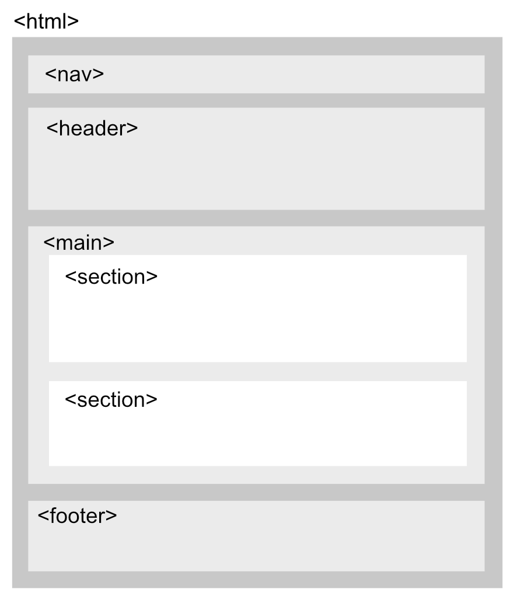

# Techniek Filosofie Onepager

Voor techniek filosifie ga je in html+css een onepager bouwen over jouw onderwerp. Je krijgt drie workshops html+css, de materialen daarvoor vind je in deze repository.

- Les 1: basics van html en css
- Les 2: een responsive blog bouwen met semantische elementen
- Les 3: een onderzoeksartikel online zetten

Klik de "Remix on glitch" button om zelf aan de Alan Kay site te sleutelen!

 
 
 

## HTML LES 1 

- Wat is een web server?
- Ga naar dit glitch project en klik **remix to edit**: https://glitch.com/edit/#!/cmgt-start
- HTML tags voor basic layout: `a, img, h1, p, br`
- Divs als containers voor tekst en afbeeldingen.
- Default CSS bekijken in de inspector
- Block heeft hoogte en breedte. Blocks worden onder elkaar geplaatst.
- Inline heeft geen hoogte en breedte en wordt naast elkaar geplaatst.
- Elementen selecteren met tags, id's en classes. 
- CSS basics: `width, height, margin, padding, border, color, units, font-family (sans, sans-serif, mono)`
- Units: `px`, `em`, `%`, `vw, vh`.
- Uitleg github pages. [(start project)](https://github.com/HR-CMGT/html-startproject)
- Finished files: https://glitch.com/edit/#!/cmgt-finished

 
 
 

## HTML LES 2

Semantic tags:

**HTML**

- Header, Nav balk, Sections, Footer [(Semantic HTML)](https://www.w3schools.com/html/html5_semantic_elements.asp)
- Centered text. Drie divs naast elkaar met flex.
- Afbeelding met caption voor bronvermelding
- Socials in footer
- Links in dezelfde pagina met `<a>` tags.

**CSS**

- Geneste elementen selecteren.
- Identiteit ontwerpen: kies een [font](https://fonts.google.com) en [kleurpalet](https://coolors.co) dat bij het onderwerp past. Je kan ook twee fonts kiezen: een fancy font voor de headers, en een rustig font voor de body tekst.
- Grote header foto met `cover` om achtergrondafbeelding te laten schalen
- Witruimte maken voor de sections en teksten voor leesbaarheid (`margin, padding, font-size`)
- Maak foto's passend met `object-fit`.
- [Flex Box](https://css-tricks.com/snippets/css/a-guide-to-flexbox/) gebruiken om elementen naast elkaar te zetten.

 
 
 

## HTML LES 3

- Inhoud blog in orde maken voor Techniek Filosofie

### Responive, accessible

- Meta viewport tag
- Social meta tags (facebook, twitter)
- Alt tags
- @Media query
- W3 Validator

### Cool stuff

- Font Awesome Icons
- Video tag, video object fit cover, audio tag
- CSS Animation, Transition
- A links as buttons

 
 
 

## Links for fun and profit

- [Startcode voor een leeg HTML project](https://github.com/HR-CMGT/html-startproject/)
- [Basis CSS](https://www.w3schools.com/cssref/css_default_values.asp) van elementen bekijken.
- [W3 HTML Validator](https://validator.w3.org)
- [Semantic HTML tags](https://www.w3schools.com/html/html5_semantic_elements.asp)
- [Learn CSS](https://web.dev/learn/css/)
- [Image Caption](https://www.w3schools.com/tags/tag_figcaption.asp)
- [Image Object Fit](https://www.w3schools.com/css/css3_object-fit.asp)
- [Flex Box](https://css-tricks.com/snippets/css/a-guide-to-flexbox/)
- [Media Query](https://css-tricks.com/a-complete-guide-to-css-media-queries/)
- [Test je site op verschillende devices met Responsively](https://responsively.app)
- [Ontwerp een responsive site met Figma](https://www.figma.com)
- [Mobile Hamburger Menu](https://www.w3schools.com/howto/howto_js_mobile_navbar.asp)
- [SEO Meta Tags](https://www.searchenginewatch.com/2018/04/04/a-quick-and-easy-guide-to-meta-tags-in-seo/)
- [Social Media Meta Tags](https://www.kontentino.com/blog/social-media-meta-tags-a-complete-guide/)
- Gebruik [Font Awesome](https://fontawesome.com) voor Icons
- [Javascript wizardry: fade in bij scrolling met de intersection observer](https://dev.to/jslim/fading-up-sections-using-intersection-observer-3fhj)
